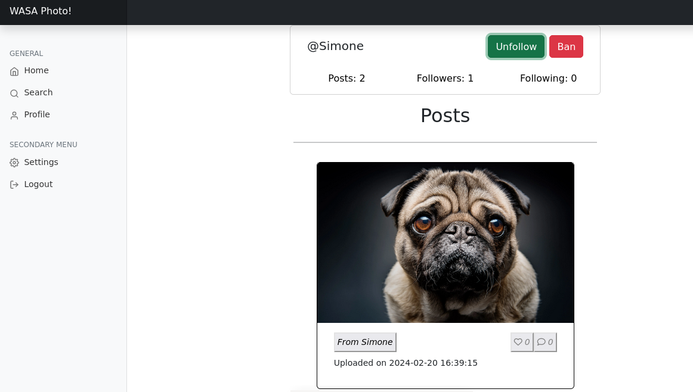

# WASAPhoto

> Keep in touch with your friends by sharing photos of special moments, thanks to WASAPhoto! Directly from your PC, you can upload your photos, and they will be  visible to everyone who is following you.



## Project structure

This repository contains the [Web and Software Architecture](http://gamificationlab.uniroma1.it/en/wasa/) homework project. It uses the [Fantastic Coffee (Decaffeinated)](https://github.com/sapienzaapps/fantastic-coffee-decaffeinated) structure.

* `cmd/` contains all executables; Go programs here should only do "executable-stuff", like reading options from the CLI/env, etc.
	* `cmd/healthcheck` is an example of a daemon for checking the health of servers daemons; useful when the hypervisor is not providing HTTP readiness/liveness probes (e.g., Docker engine)
	* `cmd/webapi` contains an example of a web API server daemon
* `demo/` contains a demo config file
* `doc/` contains the documentation (usually, for APIs, this means an OpenAPI file)
* `service/` has all packages for implementing project-specific functionalities
	* `service/api` contains an example of an API server
	* `service/globaltime` contains a wrapper package for `time.Time` (useful in unit testing)
* `vendor/` is managed by Go, and contains a copy of all dependencies
* `webui/` is an example of a web frontend in Vue.js; it includes:
	* Bootstrap JavaScript framework
	* a customized version of "Bootstrap dashboard" template
	* feather icons as SVG
	* Go code for release embedding

Other project files include:
* `open-npm.sh` starts a new (temporary) container using `node:lts` image for safe web frontend development (you don't want to use `npm` in your system, do you?)

## How to build

If you're not using the WebUI, or if you don't want to embed the WebUI into the final executable, then:

```shell
go build ./cmd/webapi/
```

If you're using the WebUI and you want to embed it into the final executable:

```shell
./open-npm.sh
# (here you're inside the NPM container)
npm run build-embed
exit
# (outside the NPM container)
go build -tags webui ./cmd/webapi/
```

## How to run (in development mode)

You can launch the backend only using:

```shell
go run ./cmd/webapi/
```

If you want to launch the WebUI, open a new tab and launch:

```shell
./open-npm.sh
# (here you're inside the NPM container)
npm run dev
```

## How to build container images

### Backend

```sh
$ docker build -t wasaphoto-backend:latest -f Dockerfile.backend .
```

### Frontend

```sh
$ docker build -t wasaphoto-frontend:latest -f Dockerfile.frontend .
```

## How to run container images

### Backend

```sh
$ docker run -it -p 3000:3000 --rm wasaphoto-backend:latest
```

### Frontend

```
$ docker run -it --rm -p 8080:80 wasaphoto-frontend:latest
```

## License

Ai-lab-object-detection is released under the [MIT License](../LICENSE).
